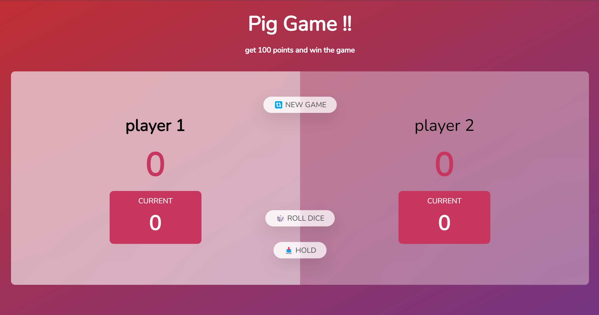

# 🎲 Pig Game

we have two players and player 1 is starting the game

each player can roll a dice multitime and increase score and when decied to hold the score click on hold button and save the score in the total score of each player

when player roll a dice and shown 1 automaticly switch to another user or when holde the score switch to another player and his trun to roll a dice

The first player get 100 points win the game and for replay a new game just click on new game

## 🛠️ Techs

HTML,CSS,JavaScript

## Demo

click on image to see the project online
